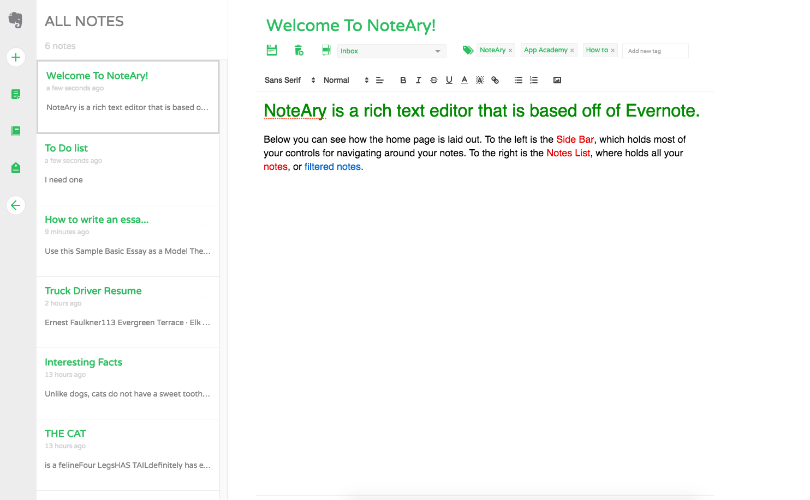
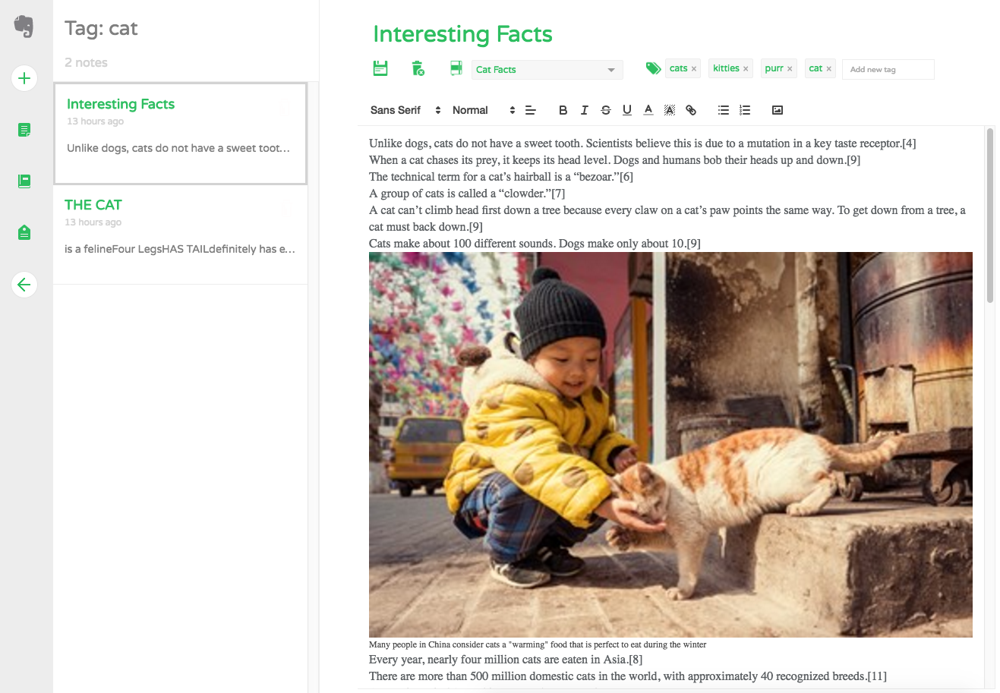
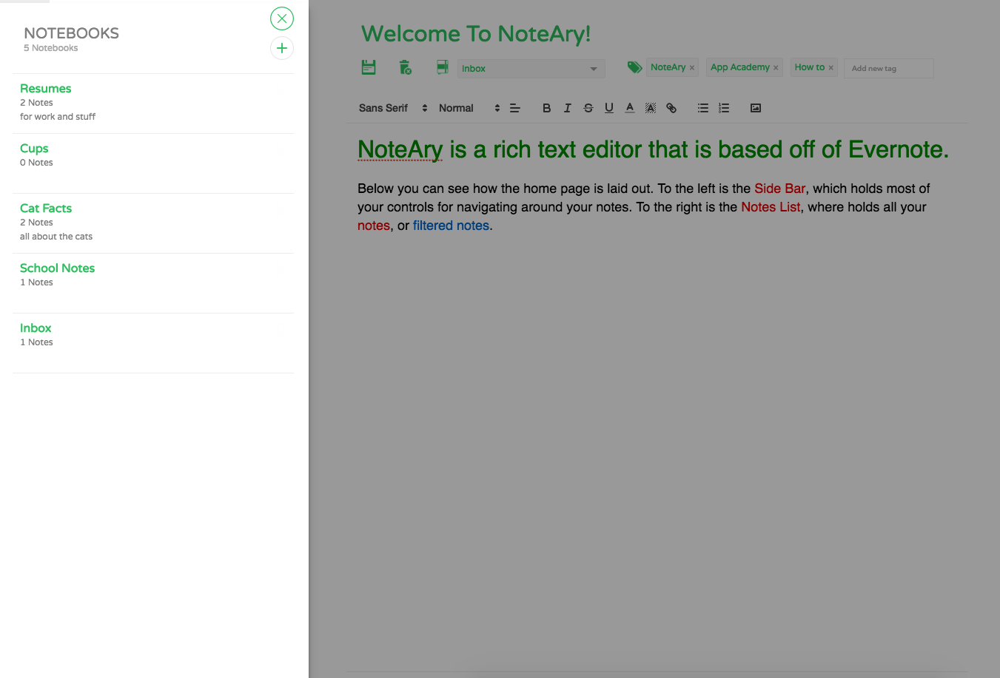
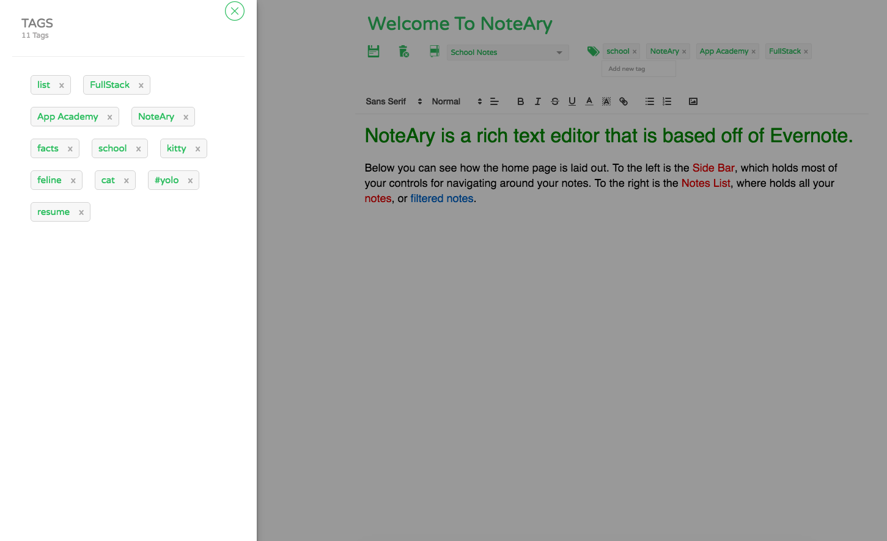

# NoteAry

[NoteAry link][noteary]

[noteary]: http://noteary.herokuapp.com/

NoteAry is a web application inspired by Evernote built using Ruby on Rails and React/Redux.

## Features & Implementation

### Toolbar

  Everything that can be done to your note is done through the note's toolbar.  It can be seen right above the note's show page, between the title and the body.  You can add tags, change notebooks, save and delete your note from here.  

### Notes

  Notes are all stored on the database and it's fetched when the user is logged in.  Note's are all editable and everything is auto-saved on the fly.  
  Notes are sorted through last updated and it can be seen live when you edit your notes in NoteAry.  All edits are updated on the database side and
  it's results are pushed back to the client side.  

  You can edit the notes in style.  All notes allow complex styling which include rich text editing.  You can include pictures, hyperlinks and much more.
  Below is an example with a resume thats formatted, ready to submit to a hungry employer.

  Pictures can be included to give your notes some flare.  There is no need to do anything fancy, just paste it or click on the image icon to upload.

  

### Notebooks

  Notebooks are a great way to organize your notes so you don't juggle through your notes.  All notes are part of a notebook and you when you sign up,
  you are automatically created a default notebook.  Notebooks can be seen when you hit the notebooks icon on the sidebar.  This brings up the notebooks drawer
  which shows all your current notebooks.  You can edit, delete and select from this drawer.

  When you click on a notebook your note's list is automatically filtered to show only this notebook's notes.  When you delete a notebook, all notes that
  live inside of that notebook get deleted as well.  In the note's show page you can always change where your note lives by clicking the drop down and choosing a new notebook home for that note.  The notebook's drawer and the note's index will update live.  Since everything is done in react, all components update individually, and only when needed.

### Tags

  Tags might be an even better way to sort through your notes.  It's effortless to add a tag to a note.  Simply type it in on the note's show page, hit enter and its there.  if the tag doesn't already exist, it will create it.  If it does exist, it won't do anything.  The database is only updated when needed and all components are updated when needed.

  Tags are created with a tags table and a tagging join table in the backend.  It links tags to notes, and if you simply want to remove the association, hitting delete just deletes the join.

